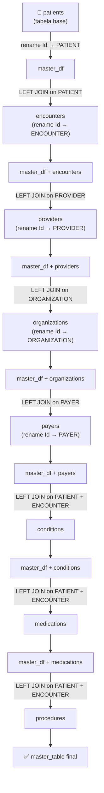

# 📋 Documentação da Master Table — Projeto Synthea

> **Projeto:** [Synthea Patient Generator](https://synthea.mitre.org)
> **Script de geração:** `main.py`
> **Notebook de análise:** `EDA_Synthea.ipynb`

---

## 1. Visão Geral

A **master_table** é uma tabela desnormalizada (flat table) que consolida dados de **8 tabelas** do Synthea em um único dataset. Ela foi projetada para permitir análises exploratórias completas sem a necessidade de realizar joins em tempo de consulta.

**Granularidade da tabela:** Cada linha representa a combinação de um **paciente** + **encontro** (consulta/internação) + **condição clínica** + **medicamento** + **procedimento**. Isso significa que um mesmo paciente pode aparecer em múltiplas linhas (relação um-para-muitos).

---

## 2. Como a Master Table Foi Gerada

O pipeline de construção é executado pelo script `main.py` usando **PySpark** e segue a ordem descrita abaixo.

### 2.1 Diagrama de Relacionamento e Ordem dos Joins

### 2.2 Etapas Detalhadas

| Etapa | Ação | Tabela Origem | Chave(s) de Join | Tipo de Join | Sufixo para Duplicadas |
|:-----:|------|:------------:|:----------------:|:------------:|:---------------------:|
| 1 | Tabela base — `patients.Id` renomeado para `PATIENT` | `patients` | — | — | — |
| 2 | Adicionar dados de consultas/internações | `encounters` | `PATIENT` | LEFT | `_encounter` |
| 3 | Adicionar dados do médico/profissional | `providers` | `PROVIDER` | LEFT | `_provider` |
| 4 | Adicionar dados da organização (hospital/clínica) | `organizations` | `ORGANIZATION` | LEFT | `_org` |
| 5 | Adicionar dados da seguradora/pagador | `payers` | `PAYER` | LEFT | `_payer` |
| 6 | Adicionar diagnósticos/condições | `conditions` | `PATIENT` + `ENCOUNTER` | LEFT | `_condition` |
| 7 | Adicionar prescrições de medicamentos | `medications` | `PATIENT` + `ENCOUNTER` | LEFT | `_medication` |
| 8 | Adicionar procedimentos realizados | `procedures` | `PATIENT` + `ENCOUNTER` | LEFT | `_procedure` |

### 2.3 Tratamento de Colunas Duplicadas

Quando duas tabelas possuem colunas com o mesmo nome (ex: `START`, `DESCRIPTION`, `CODE`), o script aplica automaticamente um **sufixo** na coluna da tabela da direita para evitar conflitos. A função `join_with_suffix()` identifica as colunas sobrepostas e as renomeia com o padrão `{COLUNA}_{sufixo}`.

### 2.4 Tabela `observations` Excluída

A tabela `observations` (sinais vitais, exames laboratoriais) foi **intencionalmente excluída** do pipeline, pois é extremamente volumosa e causaria uma explosão combinatória no dataset. Ela pode ser incorporada com cautela se necessário.

### 2.5 Saída

O resultado final é salvo como:
- **Catálogo Databricks:** `synthea.master_table.master_table` (formato Delta)
- **CSV local:** `synthea_sample_data/master_table.csv`

---

## 3. Dicionário de Colunas

A master_table contém **104 colunas**. Abaixo, cada coluna é descrita e agrupada pela tabela de origem.

---

### 3.1 — Colunas de `patients` (Dados Demográficos do Paciente)

| # | Coluna | Tipo | Descrição |
|:-:|--------|:----:|-----------|
| 1 | `PATIENT` | string (UUID) | Identificador único universal do paciente. Originalmente `Id` na tabela `patients`, renomeado para servir de chave de ligação. |
| 2 | `BIRTHDATE` | date | Data de nascimento do paciente. |
| 3 | `DEATHDATE` | date | Data de óbito do paciente. `NULL` se o paciente está vivo. |
| 4 | `SSN` | string | Número de seguro social (Social Security Number) — simulado. |
| 5 | `DRIVERS` | string | Número da carteira de motorista — simulado. |
| 6 | `PASSPORT` | string | Número do passaporte — simulado. |
| 7 | `PREFIX` | string | Prefixo do nome (ex: Mr., Mrs., Dr.). |
| 8 | `FIRST` | string | Primeiro nome do paciente. |
| 9 | `MIDDLE` | string | Nome do meio do paciente. |
| 10 | `LAST` | string | Sobrenome do paciente. |
| 11 | `SUFFIX` | string | Sufixo do nome (ex: Jr., III). |
| 12 | `MAIDEN` | string | Nome de solteira (se aplicável). |
| 13 | `MARITAL` | string | Estado civil. `M` = Casado, `S` = Solteiro. |
| 14 | `RACE` | string | Raça do paciente (ex: white, black, asian). Usado em análises de equidade em saúde. |
| 15 | `ETHNICITY` | string | Etnia do paciente (ex: hispanic, nonhispanic). |
| 16 | `GENDER` | string | Sexo biológico. `M` = Masculino, `F` = Feminino. |
| 17 | `BIRTHPLACE` | string | Local de nascimento (cidade e estado). |
| 18 | `ADDRESS` | string | Endereço residencial atual do paciente. |
| 19 | `CITY` | string | Cidade de residência. |
| 20 | `STATE` | string | Estado (UF) de residência. |
| 21 | `COUNTY` | string | Condado de residência. |
| 22 | `FIPS` | string | Código FIPS do condado (padrão federal americano para localidades). |
| 23 | `ZIP` | string | Código postal (CEP) do paciente. |
| 24 | `LAT` | double | Latitude da residência do paciente. |
| 25 | `LON` | double | Longitude da residência do paciente. |
| 26 | `HEALTHCARE_EXPENSES` | double | Total acumulado gasto em saúde ao longo da vida do paciente (em USD). |
| 27 | `HEALTHCARE_COVERAGE` | double | Total acumulado coberto por planos de saúde ao longo da vida (em USD). |
| 28 | `INCOME` | integer | Renda anual estimada do paciente (em USD). |

---

### 3.2 — Colunas de `encounters` (Consultas / Internações)

Estas colunas descrevem cada interação do paciente com o sistema de saúde. Colunas com sufixo `_encounter` são colunas que existiam tanto em `patients` quanto em `encounters` e foram renomeadas para evitar conflito.

| # | Coluna | Tipo | Descrição |
|:-:|--------|:----:|-----------|
| 29 | `ENCOUNTER` | string (UUID) | Identificador único da consulta/internação. Originalmente `Id` na tabela `encounters`. |
| 30 | `START` | timestamp | Data e hora de início do encontro (consulta/internação). |
| 31 | `STOP` | timestamp | Data e hora de término do encontro. |
| 32 | `ORGANIZATION` | string (UUID) | ID da organização (hospital/clínica) onde o encontro ocorreu. Chave de ligação com `organizations`. |
| 33 | `PROVIDER` | string (UUID) | ID do profissional de saúde (médico) responsável pelo encontro. Chave de ligação com `providers`. |
| 34 | `PAYER` | string (UUID) | ID da seguradora/plano de saúde vigente durante o encontro. Chave de ligação com `payers`. |
| 35 | `ENCOUNTERCLASS` | string | Tipo/classe do encontro. Valores comuns: `wellness` (rotina/preventiva), `ambulatory` (ambulatorial), `emergency` (emergência), `inpatient` (internação), `urgentcare` (urgência), `outpatient` (ambulatório externo). |
| 36 | `CODE` | string | Código clínico do tipo de encontro (padrão SNOMED-CT). |
| 37 | `DESCRIPTION` | string | Descrição textual do tipo de encontro (ex: "General examination of patient", "Emergency room admission"). |
| 38 | `BASE_ENCOUNTER_COST` | double | Custo administrativo base da consulta/internação (em USD). |
| 39 | `TOTAL_CLAIM_COST` | double | Valor total cobrado pela consulta, incluindo procedimentos e exames realizados durante ela (em USD). |
| 40 | `PAYER_COVERAGE` | double | Valor coberto pela seguradora para este encontro específico (em USD). |
| 41 | `REASONCODE` | string | Código SNOMED-CT da condição/razão que motivou o encontro. |
| 42 | `REASONDESCRIPTION` | string | Descrição textual do motivo que levou à consulta (ex: "Acute bronchitis"). |

---

### 3.3 — Colunas de `providers` (Profissionais de Saúde)

Dados sobre o médico/profissional responsável pelo encontro. Colunas duplicadas recebem sufixo `_provider`.

| # | Coluna | Tipo | Descrição |
|:-:|--------|:----:|-----------|
| 43 | `ORGANIZATION_provider` | string (UUID) | ID da organização à qual o profissional pertence. |
| 44 | `NAME` | string | Nome completo do profissional de saúde. |
| 45 | `GENDER_provider` | string | Sexo do profissional. `M` = Masculino, `F` = Feminino. |
| 46 | `SPECIALITY` | string | Especialidade médica (ex: "General Practice", "Internal Medicine", "Cardiology"). |
| 47 | `ADDRESS_provider` | string | Endereço do consultório/local de atendimento do profissional. |
| 48 | `CITY_provider` | string | Cidade do local de atendimento. |
| 49 | `STATE_provider` | string | Estado do local de atendimento. |
| 50 | `ZIP_provider` | string | CEP do local de atendimento. |
| 51 | `LAT_provider` | double | Latitude do local de atendimento. |
| 52 | `LON_provider` | double | Longitude do local de atendimento. |
| 53 | `ENCOUNTERS` | integer | Número total de encontros realizados pelo profissional. |
| 54 | `PROCEDURES` | integer | Número total de procedimentos realizados pelo profissional. |

---

### 3.4 — Colunas de `organizations` (Hospitais / Clínicas)

Dados sobre a instituição de saúde onde o encontro ocorreu. Colunas duplicadas recebem sufixo `_org`.

| # | Coluna | Tipo | Descrição |
|:-:|--------|:----:|-----------|
| 55 | `NAME_org` | string | Nome da organização de saúde (ex: nome do hospital). |
| 56 | `ADDRESS_org` | string | Endereço da organização. |
| 57 | `CITY_org` | string | Cidade da organização. |
| 58 | `STATE_org` | string | Estado da organização. |
| 59 | `ZIP_org` | string | CEP da organização. |
| 60 | `LAT_org` | double | Latitude da organização. |
| 61 | `LON_org` | double | Longitude da organização. |
| 62 | `PHONE` | string | Telefone da organização. |
| 63 | `REVENUE` | double | Faturamento total acumulado da organização (em USD). |
| 64 | `UTILIZATION` | integer | Taxa de utilização da organização (número total de encontros atendidos). |

---

### 3.5 — Colunas de `payers` (Seguradoras / Pagadores)

Dados sobre a seguradora ou sistema público de saúde. Colunas duplicadas recebem sufixo `_payer`.

| # | Coluna | Tipo | Descrição |
|:-:|--------|:----:|-----------|
| 65 | `NAME_payer` | string | Nome da seguradora (ex: "Medicare", "Medicaid", "Aetna", "NO_INSURANCE"). |
| 66 | `OWNERSHIP` | string | Tipo de propriedade da seguradora (ex: "Government", "Private"). |
| 67 | `ADDRESS_payer` | string | Endereço da sede da seguradora. |
| 68 | `CITY_payer` | string | Cidade da sede da seguradora. |
| 69 | `STATE_HEADQUARTERED` | string | Estado da sede da seguradora. |
| 70 | `ZIP_payer` | string | CEP da sede da seguradora. |
| 71 | `PHONE_payer` | string | Telefone da seguradora. |
| 72 | `AMOUNT_COVERED` | double | Valor total coberto pela seguradora para todos os seus clientes (em USD). |
| 73 | `AMOUNT_UNCOVERED` | double | Valor total **não** coberto pela seguradora (em USD). |
| 74 | `REVENUE_payer` | double | Receita/faturamento total da seguradora (em USD). |
| 75 | `COVERED_ENCOUNTERS` | integer | Número total de encontros cobertos pela seguradora. |
| 76 | `UNCOVERED_ENCOUNTERS` | integer | Número total de encontros **não** cobertos. |
| 77 | `COVERED_MEDICATIONS` | integer | Número total de medicamentos cobertos. |
| 78 | `UNCOVERED_MEDICATIONS` | integer | Número total de medicamentos **não** cobertos. |
| 79 | `COVERED_PROCEDURES` | integer | Número total de procedimentos cobertos. |
| 80 | `UNCOVERED_PROCEDURES` | integer | Número total de procedimentos **não** cobertos. |
| 81 | `COVERED_IMMUNIZATIONS` | integer | Número total de imunizações cobertas. |
| 82 | `UNCOVERED_IMMUNIZATIONS` | integer | Número total de imunizações **não** cobertas. |
| 83 | `UNIQUE_CUSTOMERS` | integer | Número total de clientes únicos da seguradora. |
| 84 | `QOLS_AVG` | double | Média do Quality of Life Score (índice de qualidade de vida) dos clientes. |
| 85 | `MEMBER_MONTHS` | integer | Total de meses-membro (soma dos meses que cada cliente ficou vinculado). |

---

### 3.6 — Colunas de `conditions` (Diagnósticos / Condições Clínicas)

Registros de doenças e diagnósticos vinculados ao paciente e ao encontro. Colunas duplicadas recebem sufixo `_condition`.

| # | Coluna | Tipo | Descrição |
|:-:|--------|:----:|-----------|
| 86 | `START_condition` | date | Data em que a condição/doença foi diagnosticada. |
| 87 | `STOP_condition` | date | Data em que a condição foi curada/resolvida. `NULL` indica condição **crônica** ou **ativa**. |
| 88 | `SYSTEM` | string | Sistema de codificação utilizado (ex: "http://snomed.info/sct" para SNOMED-CT). |
| 89 | `CODE_condition` | string | Código clínico da condição (padrão SNOMED-CT). |
| 90 | `DESCRIPTION_condition` | string | Nome textual da condição (ex: "Diabetes Mellitus", "Hypertension", "Acute bronchitis"). |

---

### 3.7 — Colunas de `medications` (Medicamentos / Prescrições)

Registros de medicamentos prescritos ao paciente. Colunas duplicadas recebem sufixo `_medication`.

| # | Coluna | Tipo | Descrição |
|:-:|--------|:----:|-----------|
| 91 | `START_medication` | date | Data de início da prescrição do medicamento. |
| 92 | `STOP_medication` | date | Data de término da prescrição. `NULL` indica uso contínuo. |
| 93 | `PAYER_medication` | string (UUID) | ID da seguradora que cobriu este medicamento. |
| 94 | `CODE_medication` | string | Código do medicamento (padrão RxNorm). |
| 95 | `DESCRIPTION_medication` | string | Nome comercial/genérico do medicamento (ex: "Amoxicillin 250 MG", "Metformin 500 MG"). |
| 96 | `BASE_COST` | double | Custo unitário base do medicamento (em USD). |
| 97 | `PAYER_COVERAGE_medication` | double | Valor coberto pela seguradora para este medicamento (em USD). |
| 98 | `DISPENSES` | integer | Número de vezes que o medicamento foi dispensado/retirado. |
| 99 | `TOTALCOST` | double | Custo total do medicamento (BASE_COST × DISPENSES). |
| 100 | `REASONCODE_medication` | string | Código SNOMED-CT da condição que motivou a prescrição. |
| 101 | `REASONDESCRIPTION_medication` | string | Descrição textual do motivo da prescrição (ex: "Diabetes", "Hypertension"). |

---

### 3.8 — Colunas de `procedures` (Procedimentos Médicos)

Registros de procedimentos, cirurgias e terapias realizadas. Colunas duplicadas recebem sufixo `_procedure`.

| # | Coluna | Tipo | Descrição |
|:-:|--------|:----:|-----------|
| 102 | `START_procedure` | timestamp | Data/hora de início do procedimento. |
| 103 | `STOP_procedure` | timestamp | Data/hora de término do procedimento. |
| 104 | `SYSTEM_procedure` | string | Sistema de codificação (ex: SNOMED-CT). |
| 105 | `CODE_procedure` | string | Código clínico do procedimento (padrão SNOMED-CT). |
| 106 | `DESCRIPTION_procedure` | string | Descrição textual do procedimento (ex: "Colonoscopy", "Suture of wound"). |
| 107 | `BASE_COST_procedure` | double | Custo direto do procedimento (em USD). |
| 108 | `REASONCODE_procedure` | string | Código SNOMED-CT da condição que motivou o procedimento. |
| 109 | `REASONDESCRIPTION_procedure` | string | Descrição textual do motivo do procedimento. |

---

## 4. Colunas Calculadas no EDA (Notebook)

O notebook `EDA_Synthea.ipynb` adiciona colunas derivadas durante a análise. Elas **não existem** no CSV/Delta original, sendo criadas em tempo de execução.

| Coluna | Fórmula | Descrição |
|--------|---------|-----------|
| `AGE` | `floor((data_atual - BIRTHDATE) / 365)` | Idade aproximada do paciente em anos. |
| `ELAPSED_TIME_MINUTES` | `(STOP - START) / 60` | Duração do encontro em minutos. |
| `ELAPSED_TIME_HOURS` | `(STOP - START) / 3600` | Duração do encontro em horas. |

---

## 5. Observações Importantes

- **Explosão de linhas:** Como todos os joins são do tipo `LEFT JOIN` e as tabelas clínicas (conditions, medications, procedures) têm relação **um-para-muitos** com encounters, a master_table pode conter milhões de linhas mesmo com poucas centenas de pacientes. Cada combinação paciente × encontro × condição × medicamento × procedimento gera uma linha distinta.

- **Tabela `observations` excluída:** A tabela de observações (sinais vitais, exames laboratoriais) foi deliberadamente excluída do pipeline por ser extremamente volumosa. Incorporá-la causaria uma multiplicação significativa de linhas.

- **Padrões de codificação:** Os códigos clínicos seguem os padrões internacionais:
  - **SNOMED-CT** — para diagnósticos, procedimentos e tipos de encontro
  - **RxNorm** — para medicamentos
  - **FIPS** — para localidades geográficas

---

## 6. Resumo das Chaves de Ligação

| Pergunta | Chave | Tabela de Referência |
|----------|:-----:|:--------------------:|
| Quem é o paciente? | `PATIENT` | `patients` |
| Quando/onde aconteceu? | `ENCOUNTER` | `encounters` |
| Quem atendeu? | `PROVIDER` | `providers` |
| Onde foi atendido? | `ORGANIZATION` | `organizations` |
| Quem pagou? | `PAYER` | `payers` |
| Por que foi feito? | `REASONCODE` | liga com `CODE` de `conditions` |
